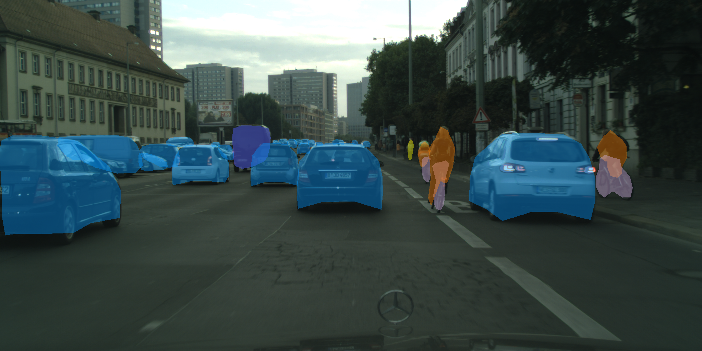
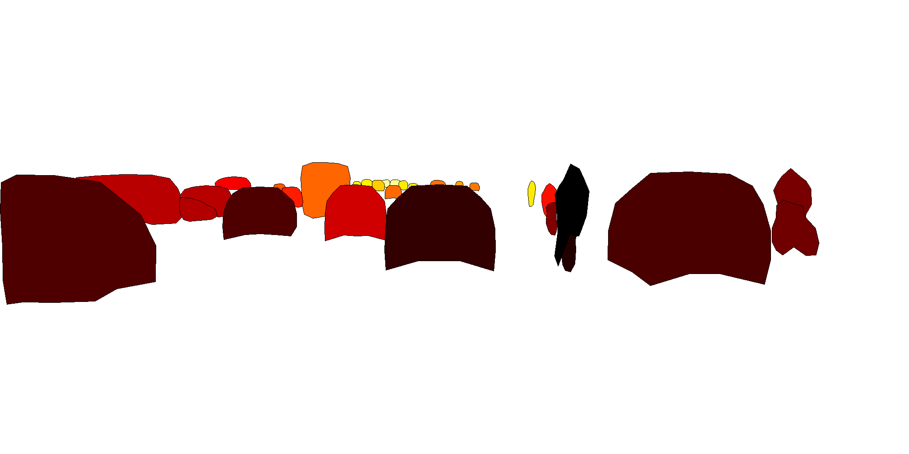
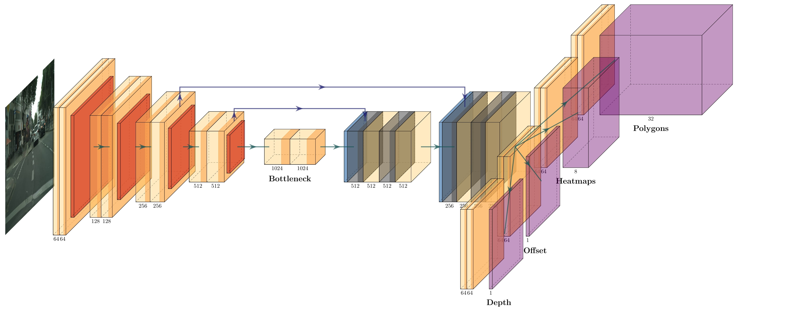

  
  
  
# CenterPoly
Repository for the paper CenterPoly: real-time instance segmentation using bounding polygons
  by Hughes Perreault1, Guillaume-Alexandre Bilodeau1, Nicolas Saunier1 and Maguelonne Héritier2.
 
1 Polytechnique Montréal
2 Genetec  
Paper: https://arxiv.org/abs/2108.08923  

## Abstract
We present a novel method, called CenterPoly, for real-time instance segmentation using bounding polygons. We apply it to detect road users in dense urban environments, making it suitable for applications in intelligent transportation systems like automated vehicles. CenterPoly detects objects by their center keypoint while predicting a fixed number of polygon vertices for each object, thus performing detection and segmentation in parallel. Most of the network parameters are shared by the network heads, making it fast and lightweight enough to run at real-time speed. To properly convert mask ground-truth to polygon ground-truth, we designed a vertex selection strategy to facilitate the learning of the polygons. Additionally, to better segment overlapping objects in dense urban scenes, we also train a relative depth branch to determine which instances are closer and which are further, using available weak annotations. We propose several models with different backbones to show the possible speed / accuracy trade-offs. The models were trained and evaluated on Cityscapes, KITTI and IDD and the results are reported on their public benchmark, which are state-of-the-art at real-time speeds. Code is available at https://github.com/hu64/CenterPoly.

## Example Result
The bounding polygons      |  The relative depthmap
:-------------------------:|:-------------------------:
  |  

## Model

An overview of the CenterPoly architecture. The image first passes through a CNN backbone, displayed here as an Hourglass network. The feature map is then shared between four network heads, the polygon regression head, the center heatmaps head used for detections, the object offset head and the relative depth map head. The sizes displayed are for illustration purposes only, please refer to the code for the detailed architecture.

## Requirements:
- pytorch (we run 1.4.0, cuda 10.0)
- various common packages

## Folder organization:
- experiments/: scripts used to launch our various experiments.
- Data path expected usually is /store/datasets/DATASET_NAME (changeable in code)
- DATASET_NAMEStuff/ are scripts related to each specific dataset, as well as our GT files
- src/lib/trains/polydet.py is our training file
- src/lib/datasets/sample/polydet.py is our sampling file
- src/lib/detectors/polydet.py is our detector file

## Help
For general debugging and help to run the scripts:  
- This code is built upon: https://github.com/xingyizhou/CenterNet
- The pre-trained weights are all available at this location

## Results:
- results on cityscapes: https://www.cityscapes-dataset.com/benchmarks/#instance-level-results
- results on KITTI: http://www.cvlibs.net/datasets/kitti/eval_instance_seg_detail.php?benchmark=instanceSeg2015&result=37b10ad4af975da6ef9cff646935bc47dce3d0ce
- results on IDD:(Anonymous with corresponding numbers) https://idd.insaan.iiit.ac.in/evaluation/leader-board/

## Model Zoo
https://polymtlca0-my.sharepoint.com/:f:/g/personal/hughes_perreault_polymtl_ca/ErIRGwMAd0lPvBxTtybUjWMBnvvqh8mNkWnaJLojlkyOWQ?e=yNjlDU

## Acknowledgements
The code for this paper is mainly built upon [CenterNet](https://github.com/xingyizhou/CenterNet), we would therefore like to thank the authors for providing the source code of their paper. We also acknowledge the support of the Natural Sciences and Engineering Research Council of Canada (NSERC), [RDCPJ 508883 - 17], and the support of Genetec.

## License
CenterPoly is released under the MIT License. Portions of the code are borrowed from [CenterNet](https://github.com/xingyizhou/CenterNet), [CornerNet](https://github.com/princeton-vl/CornerNet) (hourglassnet, loss functions), [dla](https://github.com/ucbdrive/dla) (DLA network), [DCNv2](https://github.com/CharlesShang/DCNv2)(deformable convolutions), and [cityscapesScripts](https://github.com/mcordts/cityscapesScripts) (cityscapes dataset evaluation). Please refer to the original License of these projects (See [NOTICE](NOTICE)).
